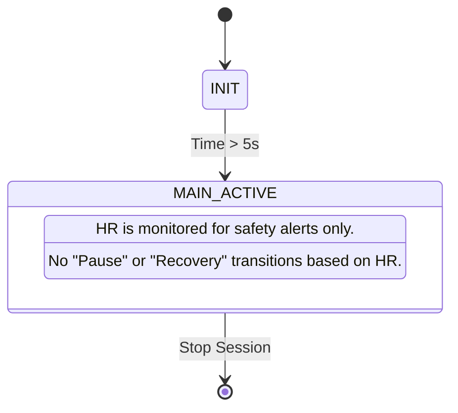

# Fixed State Transition Logic (`fixed state`)

The **Fixed State** strategy is used for objectives where heart rate is not the primary driver of the session state, such as "Strength Training".

## 1. Overview
In this mode, the system ignores heart rate floors and does not prompt the user to "speed up." The AI acts as a "Safety Spotter" or "Ambient Companion," providing narrative and safety alerts (e.g., warning if HR is too high for safe lifting) without changing the functional state of the session.

## 2. State Definitions
*   **INIT**: Initializing session and generating AI mission plans.
*   **MAIN_ACTIVE**: The continuous state for the duration of the session.

## 3. Transition Diagram

## 4. Logic Details
*   **Initialization**: A brief 5-second buffer is used to allow the AI to generate the Mission Profile and Narrative Plan before moving to the active state.
*   **State Persistence**: Once in `MAIN_ACTIVE`, the session remains in this state regardless of heart rate fluctuations.
*   **Safety Thresholds**: While the state doesn't change, the AI will still trigger "Redline" alerts if the heart rate exceeds safety limits (e.g., Zone 4/5 during a lifting session).
