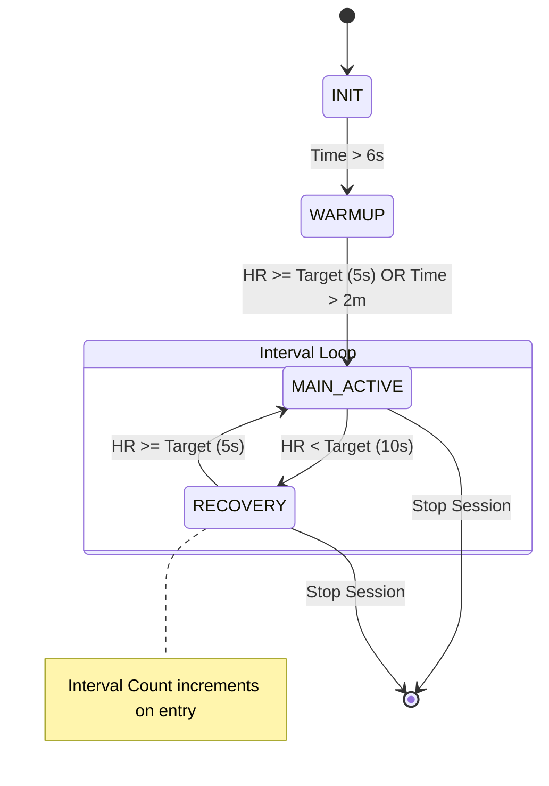
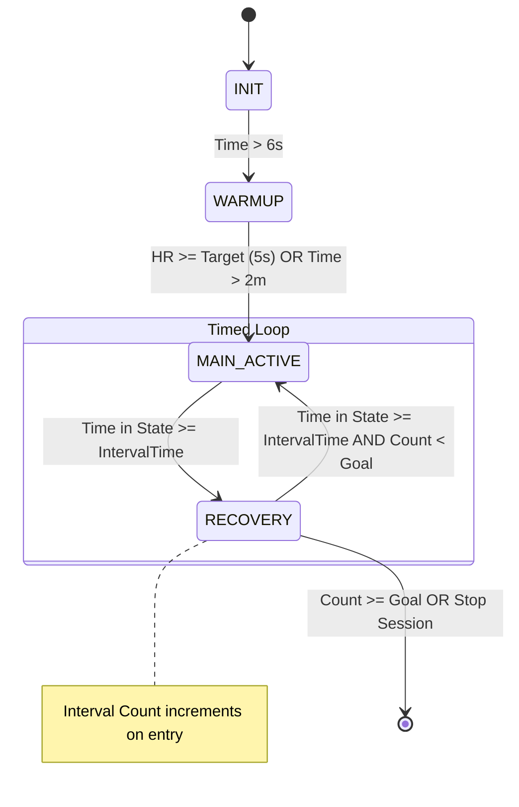

# Interval State Transition Logic (`interval state`)

The **Interval State** strategy is used for high-intensity interval training (HIIT). It supports two sub-modes: **Loose Intervals** (HR-driven) and **Fixed Intervals** (Time-driven).

## 1. Overview
Interval mode alternates between "Spikes" (`MAIN_ACTIVE`) and "Valleys" (`RECOVERY`). An "Interval Count" is incremented every time the user completes a Spike and returns to the Valley.

## 2. State Definitions
*   **INIT**: Initializing session.
*   **WARMUP**: Initial ramp-up to the first interval.
*   **MAIN_ACTIVE (Spike)**: The high-intensity work phase.
*   **RECOVERY (Valley)**: The low-intensity rest phase.

## 3. Transition Diagrams

### A. Loose Intervals (HR-Driven)
Transitions occur when the user hits specific heart rate thresholds.

### B. Fixed Intervals (Time-Driven)
Transitions occur based on the configured `Interval Time` (e.g., 3 minutes work / 3 minutes rest).

## 4. Logic Details
*   **Loose Interval Hysteresis**: Uses a 10-second debounce when dropping from a Spike to a Valley to ensure the heart rate has truly recovered.
*   **Fixed Interval Precision**: Uses `timeInStateMinutes` to trigger transitions exactly at the configured interval marks.
*   **Interval Counting**: The system increments the `intervalCount` metric upon transitioning from `MAIN_ACTIVE` to `RECOVERY`, marking the completion of a "Work" phase.
