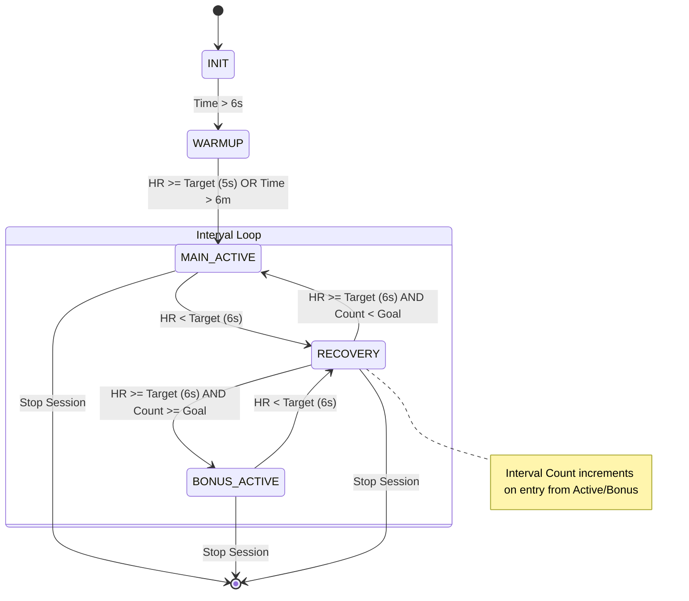

# Interval State Transition Logic (`interval state`)

The **Interval State** strategy is used for high-intensity interval training (HIIT). It is purely heart rate driven, ensuring that transitions between work and rest phases respond to the user's physiological effort.

## 1. Overview
Interval mode alternates between "Spikes" (`MAIN_ACTIVE` or `BONUS_ACTIVE`) and "Valleys" (`RECOVERY`). An "Interval Count" is incremented every time the user completes a Spike and returns to the Valley. The system continues to track intervals indefinitely, switching to `BONUS_ACTIVE` once the initial goal is met.

## 2. State Definitions
*   **INIT**: Initializing session.
*   **WARMUP**: Initial ramp-up to the first interval.
*   **MAIN_ACTIVE (Spike)**: The high-intensity work phase (before goal completion).
*   **BONUS_ACTIVE (Bonus Spike)**: The high-intensity work phase (after goal completion).
*   **RECOVERY (Valley)**: The low-intensity rest phase.

## 3. Transition Diagram

## 4. Logic Details
*   **Heart Rate Hysteresis**: Both "Spike to Valley" and "Valley to Spike" transitions use a **6-second debounce** window. This prevents flickering caused by momentary heart rate fluctuations or telemetry noise.
*   **Warmup Protocol**: The initial transition from `WARMUP` to the first `MAIN_ACTIVE` interval requires 5 seconds of sustained target HR or reaching a 6-minute wall-clock limit.
*   **Interval Counting**: The system increments the `intervalCount` metric upon transitioning from `MAIN_ACTIVE` or `BONUS_ACTIVE` to `RECOVERY`.
*   **Bonus Tracking**: Once the `intervalCountGoal` is reached, the system continues to function identically but uses the `BONUS_ACTIVE` state for work phases, allowing users to push beyond their initial target while still receiving accurate tracking and coaching.
