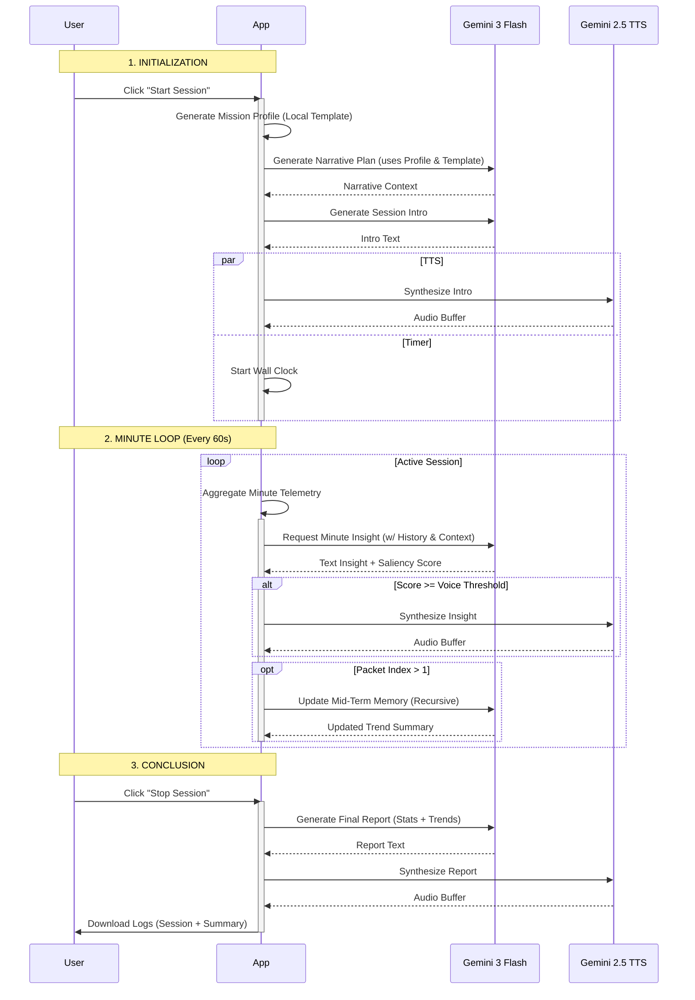

# AetherAegis LLM Architecture & Orchestration

This document outlines the specific lifecycle, timing, and data dependencies of the Generative AI calls used within the AetherAegis dashboard.

## Model Configuration

The application primarily utilizes two models via the Google GenAI SDK:

1.  **Reasoning & Text Generation**: `gemini-3-flash-preview`
    *   Chosen for low latency and high instruction-following capability.
    *   Used for all analytical, narrative, and summarization tasks.
2.  **Audio Synthesis**: `gemini-2.5-flash-preview-tts`
    *   Used for transforming AI text outputs into persona-specific audio.

---

## 1. Session Initialization Phase

These calls occur immediately after the user clicks **"START SESSION"**.

### A. Mission Profile Generator (Local)
*   **Trigger**: Immediate upon session start.
*   **Purpose**: Establishes the "Ground Truth" for the session. It calculates specific heart rate targets and defines success criteria based on the user's age and selected objective using a predefined template.
*   **Dependencies**: None.
*   **Implementation**: Local logic in `App.tsx` using templates from `training_objectives.ts`.
*   **Context/Input**: 
    *   User Age (for Max HR calculation).
    *   Selected Objective (e.g., "Weight Loss").
    *   Target Strategy (Duration/Heart Points/Calories).
*   **Output**: A structured text block defining Zone ranges and Phase protocols (e.g., "PRIMARY DIRECTIVE", "PHASE PROTOCOLS").

### B. Narrative Mission Plan
*   **Trigger**: Automatically called **after** the *Mission Profile* is successfully generated.
*   **Purpose**: Wraps the biometric data in a fictional layer based on the selected Persona.
*   **Dependencies**: Requires output from *Mission Profile*.
*   **Context/Input**: 
    *   Selected Persona (System Instruction & Mission Profile).
    *   Mission Profile text.
    *   Session Context (Duration or Interval structure).
    *   Activity Context (Conditional).
*   **Implementation**: LLM call with a **Structured Output Template** and few-shot examples (e.g., "Operation Laser-Pointer") to ensure consistent formatting.
*   **Output**: A structured timeline of narrative events (`[THEME]`, `[TIMELINE]`, `[Mission Complete]`, `[Maguffin]`, `[BONUS]`).

### C. Session Intro
*   **Trigger**: Called after the Mission Plan is generated.
*   **Purpose**: The first interaction with the user.
*   **Dependencies**: Requires Persona configuration.
*   **Context/Input**: 
    *   Persona Identity.
    *   User Goal.
    *   Objectives Context (Duration/Intervals).
    *   Narrative Context (if available).
    *   Telemetry Abstraction Instruction (Conditional).
    *   Activity Context (Conditional).
*   **Output**: A short motivating opening line.
*   **Side Effect**: Triggers **TTS Synthesis**.

---

## 2. The Minute Loop (Active Session)

These calls occur cyclically every 60 seconds once sufficient data has been collected.

### D. Minute Analysis (The "Insight")
*   **Trigger**: Every 60 seconds (triggered by wall-clock time accumulation).
*   **Purpose**: Immediate coaching feedback on the last minute of performance.
*   **Dependencies**: Requires at least 1 minute of telemetry.
*   **Context/Input**:
    *   **Persona**: Tailored system instruction (includes Mission Weight).
    *   **Goal Context**: User Goal, Mission Profile, Narrative Mission Plan.
    *   **Telemetry Abstraction Instruction** (Conditional).
    *   **Activity Context** (Conditional).
    *   **Mid-Term Memory**: The running summary of the session trend.
    *   **Objective Tracker**: Current progress vs. Goal (Time/Intervals), Compliance Score.
    *   **Short-Term History**: The specific metrics of the *previous* 2 minutes (for continuity).
    *   **Current Packet**: Raw telemetry array, Avg/Max/Min HR, HR Trend, Calories, Heart Points, Current Timers (Active Time).
*   **Output**: A concise insight string prefixed with a "Saliency Score" (e.g., `Score: [7] | Push harder!`).
*   **Side Effect**: Triggers **TTS Synthesis** *only if* the Saliency Score >= User's configured Voice Threshold.

### E. Mid-Term Memory Update
*   **Trigger**: Immediately **after** the *Minute Analysis* completes (starting from the first minute packet).
*   **Purpose**: Summarizes the session history to prevent context window bloat while maintaining a "thread" of the workout's story.
*   **Dependencies**: Recursive (Depends on the *previous* Mid-Term Memory).
*   **Context/Input**:
    *   Existing Mid-Term Memory text.
    *   Transition Log (State changes like WARMUP -> ACTIVE).
    *   Most recent Minute Packet stats.
*   **Output**: An updated, condensed summary text block.

---

## 3. Session Conclusion Phase

These calls occur immediately after the user clicks **"STOP SESSION"**.

### F. Final Session Report
*   **Trigger**: Immediate upon stop.
*   **Purpose**: Provides a professional/thematic debrief of the entire workout.
*   **Dependencies**: Full session history.
*   **Context/Input**:
    *   Persona Identity.
    *   User Goal + Activity Context.
    *   Mission Plan / Profile.
    *   Narrative Mission Plan.
    *   Telemetry Abstraction Instruction (Conditional).
    *   Total Duration & Metrics (Calories, Heart Points).
    *   Avg/Peak HR.
    *   Compliance Score (Performance Minutes in Zone).
    *   State Transition History.
    *   Mid-Term Trend.
    *   Last Minute Insight.
*   **Output**: A four-sentence maximum concluding summary.
*   **Side Effect**: Triggers **TTS Synthesis**.

---

## 4. Text-to-Speech (TTS) Pipeline

*   **Trigger**: Called by Intro (C), Minute Analysis (D), or Final Report (F).
*   **Model**: `gemini-2.5-flash-preview-tts`.
*   **Input**: 
    *   Text to speak.
    *   `ttsInstruction`: Persona-specific direction (e.g., "Speak fast and manic").
    *   `voiceName`: Specific voice model ID (e.g., 'Kore', 'Puck').
*   **Retry Logic**: Implements 1 retry on 5xx errors; aborts immediately on 429 (Quota Exceeded).

---

## Process Flow Diagram

