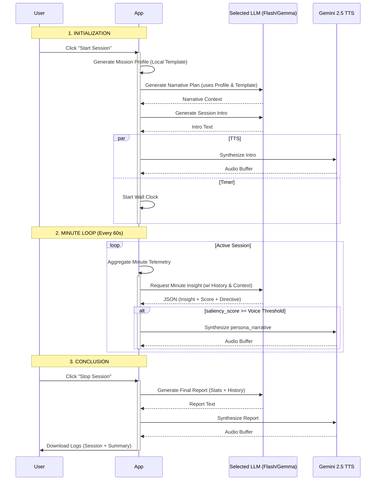

# AetherAegis LLM Architecture & Orchestration

This document outlines the specific lifecycle, timing, and data dependencies of the Generative AI calls used within the AetherAegis dashboard.

## Model Configuration

The application allows users to select their preferred model via a pulldown in the dashboard. For all analytical and periodic calls (except the initial mission generation), the user can choose between:

1.  **Gemma 4 26b a4b it** (Default)
2.  **Gemma 4 31b it**
3.  **Gemini 3.1 Flash Lite**
4.  **Gemini 3.1 Flash**

**Key Parameters**:
*   **Thinking Level**: All models are configured with `ThinkingLevel.MINIMAL` (or equivalent "no thinking" settings) to prioritize low-latency coaching responses.
*   **Mission Generation**: Now utilizes the **selected user model** (defaulting to Gemma 4 26b) for narrative planning, ensuring consistency across all session calls.
*   **Audio Synthesis**: Uses `gemini-2.5-flash-preview-tts` for voice output.

---

## 1. Session Initialization Phase

These calls occur immediately after the user clicks **"START SESSION"**.

### A. Mission Profile Generator (Local)
*   **Trigger**: Immediate upon session start.
*   **Purpose**: Establishes the "Ground Truth" for the session. It calculates specific heart rate targets and defines success criteria based on the user's age and selected objective using a predefined template.
*   **Dependencies**: None.
*   **Implementation**: Local logic in `App.tsx` using templates from `training_objectives.ts`.
*   **Context/Input**: 
    *   User Age (for Max HR calculation).
    *   Selected Objective (e.g., "Weight Loss").
    *   Target Strategy (Duration/Heart Points/Calories).
*   **Output**: A structured text block defining Zone ranges and Phase protocols (e.g., "PRIMARY DIRECTIVE", "PHASE PROTOCOLS").

### B. Narrative Mission Plan
*   **Trigger**: Automatically called after the Mission Profile is successfully generated.
*   **Purpose**: Programmatically generates a base template (via `generateMissionPlanTemplate`) and then uses AI to fill it with narrative flavor (thematic interpretation).
*   **Logic**: Calculates precise timestamps for intervals or milestones based on the strategy. The LLM's role is strictly to recontextualize these technical milestones into the persona's thematic world.
*   **Dependencies**: Requires session parameters (duration, interval count/time).
*   **Context/Input**: 
    *   Selected Persona (System Instruction & Mission Profile).
    *   Programmatically generated template (the `OUTPUT FORMAT` structure).
    *   Session Context (Duration or Interval structure).
    *   Activity Context (Conditional).
*   **Implementation**: LLM call (selected user model) with a **Strict Structured Template**. 
    *   **Hard Constraints**: Match the provided structure exactly, preserve all `M:SS` timestamps, and only replace bracketed placeholders with "flavor" text.
    *   **Tone**: Use a neutral, cinematic, third-person "Dungeon Master" voice (not first-person persona roleplay).
*   **Output**: A structured timeline of narrative events (`[THEME]`, `[TIMELINE]`, `[Mission Complete]`, `[Maguffin]`, `[BONUS]`).

### C. Session Intro
*   **Trigger**: Called after the Mission Plan is generated.
*   **Purpose**: The first interaction with the user.
*   **Dependencies**: Requires Persona configuration.
*   **Context/Input**: 
    *   Persona Identity.
    *   User Goal.
    *   Objectives Context (Duration/Intervals).
    *   Narrative Context (if available).
    *   Telemetry Abstraction Instruction (Conditional).
    *   Activity Context (Conditional).
*   **Output**: A short motivating opening line. (1,024 `maxOutputTokens` in `generationConfig`).
*   **Side Effect**: Triggers **TTS Synthesis**.

---

## 2. The Minute Loop (Active Session)

These calls occur cyclically every 60 seconds once sufficient data has been collected.

### D. Minute Analysis (The "Insight")
*   **Trigger**: Every 60 seconds (triggered by wall-clock time accumulation).
*   **Purpose**: Immediate coaching feedback on the last minute of performance.
*   **Dependencies**: Requires at least 1 minute of telemetry.
*   **Structure**: The prompt is structured hierarchically using XML-like tags (e.g., `<task>`, `<persona>`, `<mission_profile>`, `<objective_tracker>`, `<transition_history>`, `<short_term_context>`, `<current_minute_packet>`, `<current_timers>`), ordered from static to volatile data.
*   **Context/Input**:
    *   **Persona**: Tailored system instruction.
    *   **Goal Context**: User Goal, Mission Profile, Narrative Mission Plan.
    *   **Telemetry Abstraction Instruction** (Conditional).
    *   **Activity Context** (Conditional).
    *   **Transition History**: Log of all state changes within the session.
    *   **Objective Tracker**: Current progress vs. Goal (Time/Intervals), Compliance Score.
    *   **Short-Term History**: The specific metrics of the *previous* 2 minutes (for continuity).
    *   **Current Packet**: BPM (cur/avg/max/min), HR Trend, Coaching Direction, Importance, Safety Flag.
*   **Output**: A JSON object containing a saliency score, coaching directive, persona narrative, and TTS instructions. (600 `maxOutputTokens` in `generationConfig`).
*   **Side Effect**: Triggers **TTS Synthesis** *only if* the `saliency_score` >= User's configured Voice Threshold.

---

## 3. Session Conclusion Phase

These calls occur immediately after the user clicks **"STOP SESSION"**.

### E. Final Session Report
*   **Trigger**: Immediate upon stop.
*   **Purpose**: Provides a professional/thematic debrief of the entire workout.
*   **Dependencies**: Full session history.
*   **Context/Input**:
    *   Persona Identity.
    *   User Goal + Activity Context.
    *   Mission Plan / Profile.
    *   Narrative Mission Plan.
    *   Telemetry Abstraction Instruction (Conditional).
    *   Total Duration & Metrics (Calories, Heart Points).
    *   Avg/Peak HR.
    *   Compliance Score (Performance Minutes in Zone).
    *   State Transition History.
    *   Last Minute Insight.
*   **Output**: A four-sentence maximum concluding summary. (1,536 `maxOutputTokens` in `generationConfig`).
*   **Side Effect**: Triggers **TTS Synthesis**.

---

## 4. Text-to-Speech (TTS) Pipeline

*   **Trigger**: Called by Intro (C), Minute Analysis (D), or Final Report (E).
*   **Model**: `gemini-2.5-flash-preview-tts`.
*   **Input**: 
    *   Text to speak.
    *   `ttsInstruction`: Persona-specific direction (e.g., "Speak fast and manic").
    *   `voiceName`: Specific voice model ID (e.g., 'Kore', 'Puck').
*   **Retry Logic**: Implements 1 retry on 5xx errors; aborts immediately on 429 (Quota Exceeded).

---

## Process Flow Diagram

