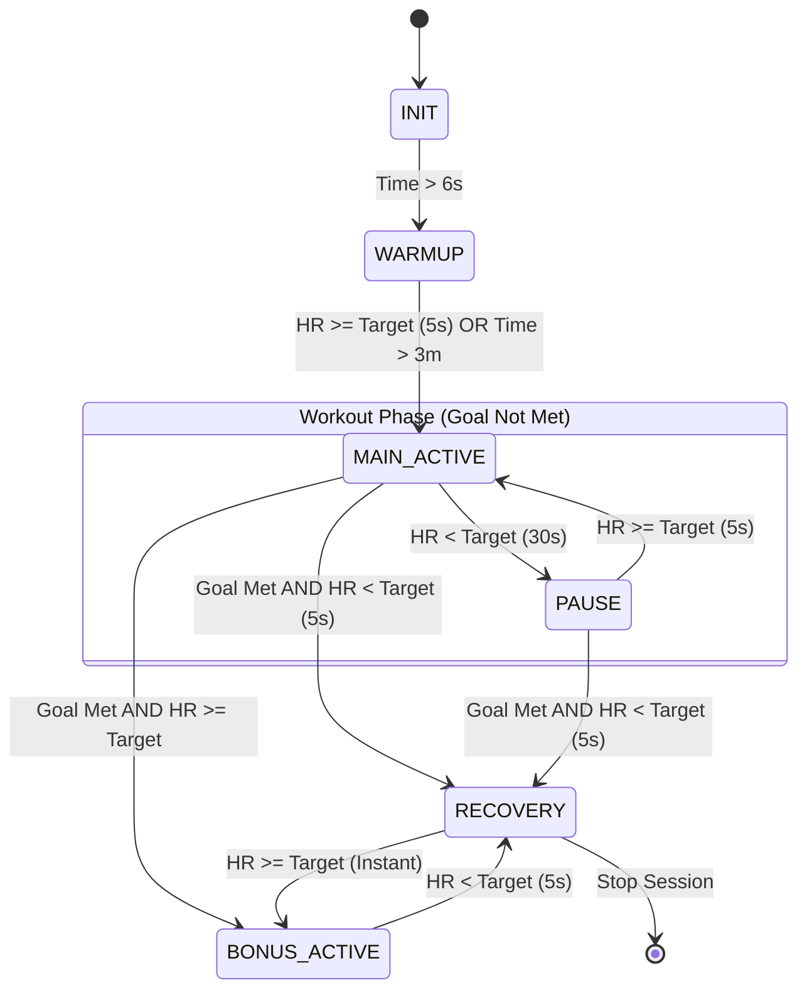

# Normal State Transition Logic (`normal state`)

The **Normal State** strategy is used for steady-state cardio objectives like "Metabolic Burn". It focuses on maintaining a heart rate within a specific target zone for a set duration.

## 1. Overview
In this mode, the system tracks "Performance Minutes"—time spent in `MAIN_ACTIVE` or `BONUS_ACTIVE` states. It uses a **30-second hysteresis** for dropping into a `PAUSE` state to prevent flickering during brief telemetry dips or rest periods.

## 2. State Definitions
*   **INIT**: Initializing session and generating AI mission plans.
*   **WARMUP**: Initial ramp-up period (3 minutes or HR target).
*   **MAIN_ACTIVE**: The primary workout phase where goals are being pursued.
*   **PAUSE**: Triggered when HR drops below the target zone for 30 seconds.
*   **BONUS_ACTIVE**: Triggered when the duration goal is met but the user maintains intensity.
*   **RECOVERY**: Triggered when the goal is met and the heart rate drops below the target.

## 3. Transition Diagram

## 4. Logic Details
*   **Warmup to Main**: Requires 5 seconds of sustained target HR or reaching the 3-minute wall-clock limit.
*   **Main to Pause**: Requires **30 seconds** of sustained HR below the target floor.
*   **Pause to Main**: Requires 5 seconds of sustained HR at or above the target floor.
*   **Goal Completion**: Once `PerformanceMinutes >= DurationGoal`, the system switches to "Post-Workout" logic.
    *   If the user is currently pushing (HR >= Target), they transition to `BONUS_ACTIVE`.
    *   If the user is cooling down (HR < Target for 5s), they transition to `RECOVERY`.
*   **Recovery Spike**: If the user is in `RECOVERY` but their heart rate spikes back above the target, the system instantly transitions back to `BONUS_ACTIVE` to resume performance tracking.
