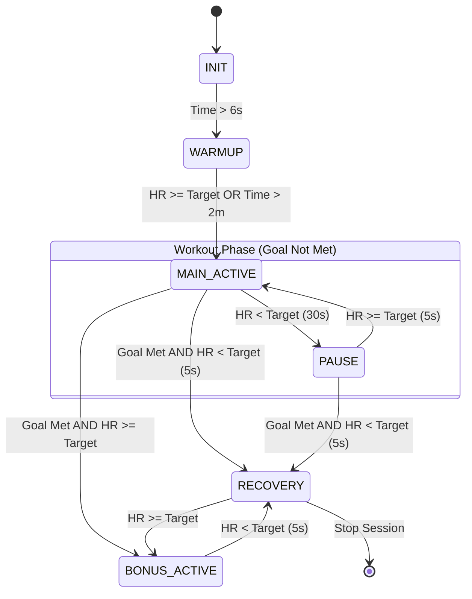

# Normal State Transition Logic (`normal state`)

The **Normal State** strategy is used for steady-state cardio objectives like "Metabolic Burn". It focuses on maintaining a heart rate within a specific target zone for a set duration.

## 1. Overview
In this mode, the system tracks "Performance Minutes"—time spent in `MAIN_ACTIVE` or `BONUS_ACTIVE` states. It uses a 30-second hysteresis for dropping into a `PAUSE` state to prevent flickering during brief telemetry dips.

## 2. State Definitions
*   **INIT**: Initializing session and generating AI mission plans.
*   **WARMUP**: Initial 2-minute ramp-up period.
*   **MAIN_ACTIVE**: The primary workout phase where goals are being pursued.
*   **PAUSE**: Triggered when HR drops below the target zone for an extended period.
*   **BONUS_ACTIVE**: Triggered when the duration goal is met but the user maintains intensity.
*   **RECOVERY**: Triggered when the goal is met and the heart rate drops below the target.

## 3. Transition Diagram

## 4. Logic Details
*   **Warmup to Main**: Requires 5 seconds of sustained target HR or reaching the 2-minute wall-clock limit.
*   **Main to Pause**: Requires 30 seconds of sustained HR below the target floor.
*   **Pause to Main**: Requires 5 seconds of sustained HR at or above the target floor.
*   **Goal Completion**: Once `PerformanceMinutes >= DurationGoal`, the system switches to "Post-Workout" logic, where the user is either in `BONUS_ACTIVE` (pushing) or `RECOVERY` (cooling down).
